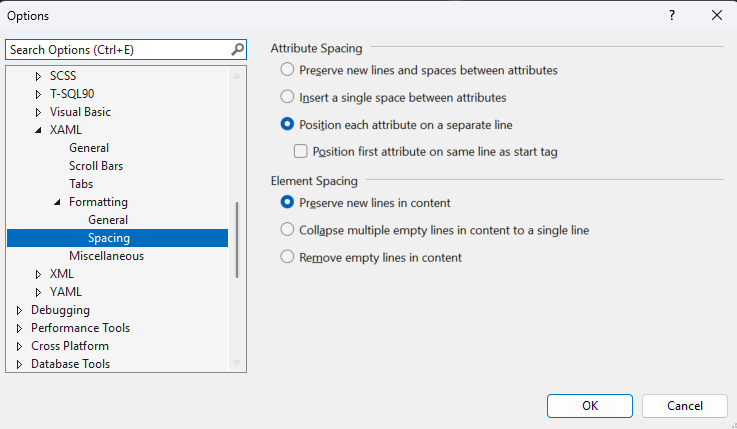

# Prog_122_L13_RadioButtonsCheckBoxes

## Turning on Next Line Properties for XAML
***Tools -> Options - Search Xaml - Spacing***



```xml
       <Button
            x:Name="btnDisplay"
            Content="Display"
            Canvas.Left="138"
            Canvas.Top="104"
            Height="48"
            Width="145" />
```


## Davids Tip for Efficency

Select -> Alt + Click + Drag will make a copy and drag the control with it

## What does NULL mean?

Null means that something does NOT exists.

## Questions Asked
So like would this be a good format for like a test? Like if you click the right  box it comes out as true?